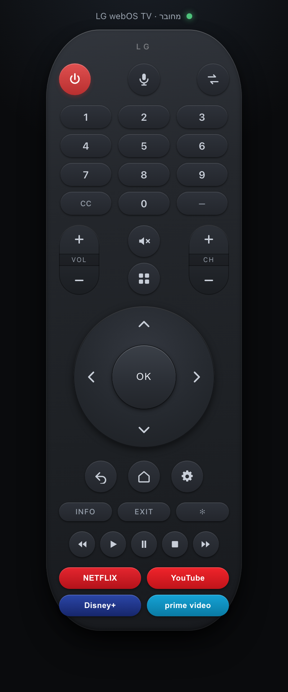

# RemoteC — שלט LG webOS ל-macOS

אפליקציית macOS (Electron) + שרת Node.js קטן לשליטה בטלוויזיות LG webOS דרך פרוטוקול SSAP על WebSocket,
עם ממשק שמחקה את ה-Magic Remote המקורי.

<p align="center">
  
</p>

## דרישות
- Node.js 18+
- טלוויזיית LG webOS מחוברת לאותה רשת מקומית
- כתובת ה-IP של הטלוויזיה (בטלוויזיה: Settings → Network → כתובת IP)
- לצורך הדלקה מרחוק (Wake-on-LAN): כתובת ה-MAC של הטלוויזיה, ובטלוויזיה יש להפעיל את "Mobile TV On" תחת Network / Connection

## התקנה
```bash
cp config.example.json config.json
# ערוך את config.json והכנס את ה-IP וה-MAC של הטלוויזיה שלך
npm install
npm start            # אפליקציית Electron
npm run server       # שרת בלבד, ואז http://localhost:3030
npm run build:mac    # בונה DMG ל-arm64 ול-x64 לתוך dist/
```

## חיבור ראשוני (Pairing)
בפעם הראשונה שהשרת יתחבר לטלוויזיה יופיע חלון על מסך הטלוויזיה שמבקש אישור.
לחץ *Yes* עם השלט הפיזי. מפתח החיבור יישמר — ומאותו רגע האישור לא יידרש שוב, גם לא אחרי הפעלה מחדש.

איפה נשמרים המפתח והקונפיג:

| הרצה | מיקום |
| --- | --- |
| `npm run server` (Node בלבד) | `client-key.json` בתיקיית הפרויקט |
| אפליקציית RemoteC (Electron / DMG) | `~/Library/Application Support/RemoteC/` |

באפליקציה הארוזה **חובה** שהמפתח יישמר מחוץ לחבילה: `__dirname` מצביע לתוך `app.asar` שהוא לקריאה בלבד,
ולכן כתיבה לשם נכשלת בשקט והטלוויזיה מבקשת אישור בכל הפעלה. `startServer` מקבל `dataDir` כדי למנוע את זה.
מאותה סיבה אין להריץ את האפליקציה מתוך ה-DMG המחובר — יש להעתיק אותה ל-`/Applications`.

אם השמירה נכשלת בכל זאת, `/api/status` מחזיר `keyError` והנורית בממשק נדלקת באדום במקום להיכשל בשקט.

### כבר אושר פעם אחת ועדיין נשאלים?
המפתח מתיקיית הפרויקט מועבר אוטומטית לתיקיית הנתונים בהרצה הראשונה, או שניתן להעתיק ידנית:
```bash
cp client-key.json ~/Library/Application\ Support/RemoteC/client-key.json
```

## קונפיגורציה באפליקציה
`config.json` נטען מ-`~/Library/Application Support/RemoteC/config.json` (נזרע אוטומטית בהרצה הראשונה
מ-`config.json` שבחבילה, ואם אין — מ-`config.example.json`).
תפריט *Remote → Reveal config.json* פותח את הקובץ הניתן לעריכה, ו-*Reveal data folder* את תיקיית הנתונים.

## הממשק
- **מקש הפעלה אחד** כמו בשלט האמיתי: כשהטלוויזיה מחוברת הוא מכבה, וכשהיא כבויה הוא שולח Wake-on-LAN (ואז נצבע בירוק).
- **גלגל Magic Remote** — ארבע גזרות כיווניות סביב OK מרכזי.
- **רוקרים** ל-VOL ול-CH, עם מקש השתקה יחיד שקורא את מצב ההשתקה מהטלוויזיה והופך אותו.
- **לחיצה ארוכה חוזרת** על עוצמה, ערוץ וחצים, כמו החזקת מקש בשלט.
- **נורית מצב** מציגה חיבור / המתנה לאישור / תקלה.
- **מקשי קיצור לאפליקציות** (Netflix, YouTube, Disney+, prime video) נבנים לפי מה שמותקן בטלוויזיה בפועל.
- **מגירות**: 🎙 הודעה למסך, ⇄ בחירת מקור (HDMI/AV — לא מחוברים מוצגים מעומעמים), ⠿ כל האפליקציות עם האייקונים מהטלוויזיה.

### מקשי מקלדת
| מקש | פעולה |
| --- | --- |
| חצים / Enter | ניווט ו-OK |
| Backspace / Esc | חזרה / יציאה |
| רווח | Play-Pause |
| `+` / `−` | עוצמה |
| `m` | השתקה |
| `h` | בית |
| `0`–`9` | מקשי ספרות |

## API
| Endpoint | תיאור |
| --- | --- |
| `GET /api/status` | מצב חיבור, המתנה לאישור, נתיב מפתח, `keyError` |
| `POST /api/power/on` \| `/api/power/off` | Wake-on-LAN / כיבוי |
| `POST /api/volume/up` \| `/down` \| `/set` | עוצמה |
| `POST /api/mute` \| `/api/mute/toggle` | השתקה מוחלטת או היפוך המצב הנוכחי |
| `GET /api/audio` | עוצמה ומצב השתקה מהטלוויזיה |
| `POST /api/channel/up` \| `/down` | ערוץ |
| `POST /api/button/:name` | מקש דרך ה-pointer socket (`UP`, `ENTER`, `HOME`, `0`–`9`, `CC`, `DASH`, `ASTERISK`…) |
| `POST /api/media/play` \| `/pause` \| `/stop` \| `/rewind` \| `/forward` | בקרת נגינה |
| `GET /api/apps` · `POST /api/apps/launch` | רשימת אפליקציות והפעלה |
| `GET /api/inputs` · `POST /api/input` | רשימת מקורות ומעבר ביניהם |
| `GET /api/icon?url=…` | פרוקסי לאייקונים של הטלוויזיה (מוגבל ל-IP שבקונפיג) |
| `POST /api/toast` | הודעת Toast למסך |

האייקונים של האפליקציות מוגשים מהטלוויזיה ב-HTTPS עם תעודה עצמית, שהדפדפן דוחה — לכן הם עוברים דרך
`/api/icon`, שמאמת שה-host זהה ל-`tvIp` שבקונפיג ולא מהווה פרוקסי פתוח.

## הערות רשת
- כברירת מחדל החיבור הוא `wss://<ip>:3001` (תעודה עצמית, ולכן `rejectUnauthorized: false`).
  לטלוויזיות ישנות שתומכות רק ב-WS יש להריץ עם `REMOTEC_WSS=0`.
- שמור על IP קבוע לטלוויזיה בראוטר (DHCP reservation) כדי שהחיבור לא ישבר.
- `config.json` ו-`client-key.json` אינם נכנסים ל-git — הם מכילים את כתובות הבית ואת מפתח החיבור.

## רישיון
MIT
